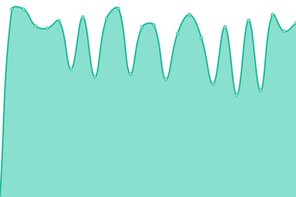
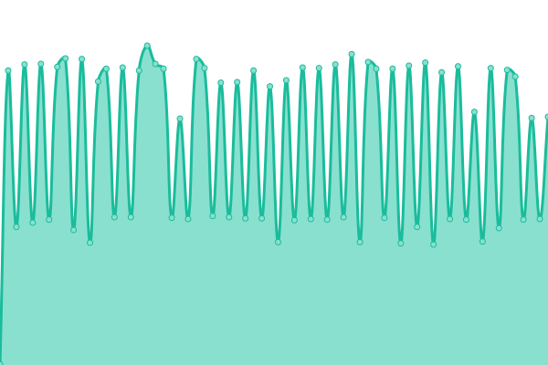
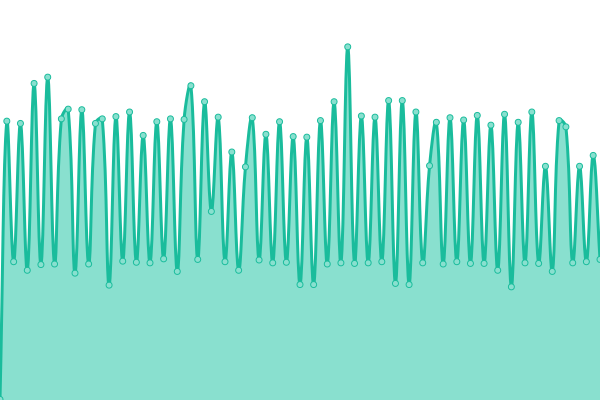
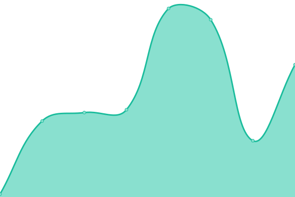
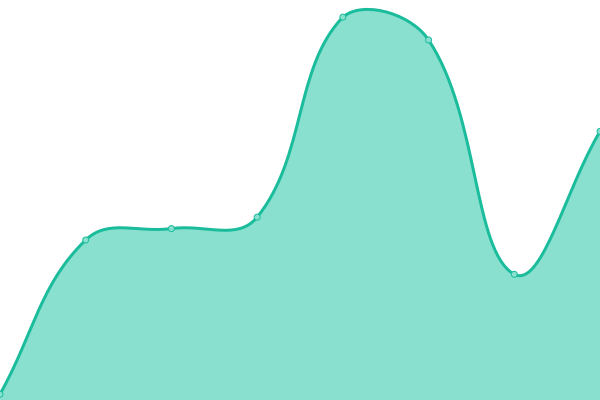

# [📈 Live Status](https://status.ramidregos.com): <!--live status--> **🟧 Partial outage**

This repository contains the open-source uptime monitor and status page for [Upptime](https://upptime.js.org), powered by [Upptime](https://github.com/upptime/upptime).

With [Upptime](https://upptime.js.org), you can get your own unlimited and free uptime monitor and status page, powered entirely by a GitHub repository. We use [Issues](https://github.com/upptime/upptime/issues) as incident reports, [Actions](https://github.com/dregos13/status_client/actions) as uptime monitors, and [Pages](https://status.ramidregos.com) for the status page.

<!--start: status pages-->
<!-- This summary is generated by Upptime (https://github.com/upptime/upptime) -->
<!-- Do not edit this manually, your changes will be overwritten -->
<!-- prettier-ignore -->
| URL | Status | History | Response Time | Uptime |
| --- | ------ | ------- | ------------- | ------ |
|  ACES - Front | 🟩 Up | [aces-front.yml](https://github.com/Dregos13/ClientStatus/commits/HEAD/history/aces-front.yml) | 

 1006ms
     
 | 

<a href="https://status.ramidregos.com/history/aces-front">100.00%</a>
    

|  Aces - Comments | 🟩 Up | [aces-comments.yml](https://github.com/Dregos13/ClientStatus/commits/HEAD/history/aces-comments.yml) | 

 350ms
     
 | 

<a href="https://status.ramidregos.com/history/aces-comments">37.81%</a>
    

|  Aces - Dashboards | 🟩 Up | [aces-dashboards.yml](https://github.com/Dregos13/ClientStatus/commits/HEAD/history/aces-dashboards.yml) | 

 62ms
     
 | 

<a href="https://status.ramidregos.com/history/aces-dashboards">37.74%</a>
    

|  Aces - Data-Logger | 🟩 Up | [aces-data-logger.yml](https://github.com/Dregos13/ClientStatus/commits/HEAD/history/aces-data-logger.yml) | 

 59ms
     
 | 

<a href="https://status.ramidregos.com/history/aces-data-logger">37.63%</a>
    

|  Aces - Data-Processing | 🟩 Up | [aces-data-processing.yml](https://github.com/Dregos13/ClientStatus/commits/HEAD/history/aces-data-processing.yml) | 

 62ms
     
 | 

<a href="https://status.ramidregos.com/history/aces-data-processing">37.62%</a>
    

|  Aces - Data-Sender | 🟥 Down | [aces-data-sender.yml](https://github.com/Dregos13/ClientStatus/commits/HEAD/history/aces-data-sender.yml) | 

 60ms
     
 | 

<a href="https://status.ramidregos.com/history/aces-data-sender">0.03%</a>
    

|  Aces - Hierarchy | 🟩 Up | [aces-hierarchy.yml](https://github.com/Dregos13/ClientStatus/commits/HEAD/history/aces-hierarchy.yml) | 

 60ms
     
 | 

<a href="https://status.ramidregos.com/history/aces-hierarchy">37.60%</a>
    

|  Aces - Instruments | 🟩 Up | [aces-instruments.yml](https://github.com/Dregos13/ClientStatus/commits/HEAD/history/aces-instruments.yml) | 

 59ms
     
 | 

<a href="https://status.ramidregos.com/history/aces-instruments">37.54%</a>
    

|  Aces - Layers | 🟩 Up | [aces-layers.yml](https://github.com/Dregos13/ClientStatus/commits/HEAD/history/aces-layers.yml) | 

 66ms
     
 | 

<a href="https://status.ramidregos.com/history/aces-layers">37.49%</a>
    

|  Aces - Notifications | 🟩 Up | [aces-notifications.yml](https://github.com/Dregos13/ClientStatus/commits/HEAD/history/aces-notifications.yml) | 

 63ms
     
 | 

<a href="https://status.ramidregos.com/history/aces-notifications">37.48%</a>
    

|  AlUla | 🟩 Up | [al-ula.yml](https://github.com/Dregos13/ClientStatus/commits/HEAD/history/al-ula.yml) | 

 1013ms
     
 | 

<a href="https://status.ramidregos.com/history/al-ula">100.00%</a>
    

|  AlUla - Comments | 🟩 Up | [al-ula-comments.yml](https://github.com/Dregos13/ClientStatus/commits/HEAD/history/al-ula-comments.yml) | 

 1457ms
     
 | 

<a href="https://status.ramidregos.com/history/al-ula-comments">37.39%</a>
    

|  AlUla - Dashboards | 🟩 Up | [al-ula-dashboards.yml](https://github.com/Dregos13/ClientStatus/commits/HEAD/history/al-ula-dashboards.yml) | 

 444ms
     
 | 

<a href="https://status.ramidregos.com/history/al-ula-dashboards">37.32%</a>
    

|  AlUla - Data-Logger | 🟩 Up | [al-ula-data-logger.yml](https://github.com/Dregos13/ClientStatus/commits/HEAD/history/al-ula-data-logger.yml) | 

 442ms
     
 | 

<a href="https://status.ramidregos.com/history/al-ula-data-logger">37.23%</a>
    

|  AlUla - Data-Processing | 🟩 Up | [al-ula-data-processing.yml](https://github.com/Dregos13/ClientStatus/commits/HEAD/history/al-ula-data-processing.yml) | 

 443ms
     
 | 

<a href="https://status.ramidregos.com/history/al-ula-data-processing">37.20%</a>
    

|  AlUla - Data-Sender | 🟥 Down | [al-ula-data-sender.yml](https://github.com/Dregos13/ClientStatus/commits/HEAD/history/al-ula-data-sender.yml) | 

 220ms
     
 | 

<a href="https://status.ramidregos.com/history/al-ula-data-sender">0.06%</a>
    

|  AlUla - Hierarchy | 🟩 Up | [al-ula-hierarchy.yml](https://github.com/Dregos13/ClientStatus/commits/HEAD/history/al-ula-hierarchy.yml) | 

 441ms
     
 | 

<a href="https://status.ramidregos.com/history/al-ula-hierarchy">37.19%</a>
    

|  AlUla - Instruments | 🟩 Up | [al-ula-instruments.yml](https://github.com/Dregos13/ClientStatus/commits/HEAD/history/al-ula-instruments.yml) | 

 443ms
     
 | 

<a href="https://status.ramidregos.com/history/al-ula-instruments">37.09%</a>
    

|  AlUla - Layers | 🟩 Up | [al-ula-layers.yml](https://github.com/Dregos13/ClientStatus/commits/HEAD/history/al-ula-layers.yml) | 

 448ms
     
 | 

<a href="https://status.ramidregos.com/history/al-ula-layers">37.09%</a>
    

|  AlUla - Notifications | 🟩 Up | [al-ula-notifications.yml](https://github.com/Dregos13/ClientStatus/commits/HEAD/history/al-ula-notifications.yml) | 

 451ms
     
 | 

<a href="https://status.ramidregos.com/history/al-ula-notifications">37.05%</a>
    

|  AlUla - Instruments | 🟩 Up | [al-ula-instruments.yml](https://github.com/Dregos13/ClientStatus/commits/HEAD/history/al-ula-instruments.yml) | 

 443ms
     
 | 

<a href="https://status.ramidregos.com/history/al-ula-instruments">37.12%</a>
    

|  AlUla - Layers | 🟩 Up | [al-ula-layers.yml](https://github.com/Dregos13/ClientStatus/commits/HEAD/history/al-ula-layers.yml) | 

 448ms
     
 | 

<a href="https://status.ramidregos.com/history/al-ula-layers">37.13%</a>
    

|  AlUla - Notifications | 🟩 Up | [al-ula-notifications.yml](https://github.com/Dregos13/ClientStatus/commits/HEAD/history/al-ula-notifications.yml) | 

 451ms
     
 | 

<a href="https://status.ramidregos.com/history/al-ula-notifications">37.08%</a>
    

|  America | 🟩 Up | [america.yml](https://github.com/Dregos13/ClientStatus/commits/HEAD/history/america.yml) | 

 223ms
     
 | 

<a href="https://status.ramidregos.com/history/america">100.00%</a>
    

|  America - Comments | 🟥 Down | [america-comments.yml](https://github.com/Dregos13/ClientStatus/commits/HEAD/history/america-comments.yml) | 

 123ms
     
 | 

<a href="https://status.ramidregos.com/history/america-comments">0.26%</a>
    

|  America - Dashboards | 🟥 Down | [america-dashboards.yml](https://github.com/Dregos13/ClientStatus/commits/HEAD/history/america-dashboards.yml) | 

 18ms
     
 | 

<a href="https://status.ramidregos.com/history/america-dashboards">0.00%</a>
    

|  America - Data-Logger | 🟥 Down | [america-data-logger.yml](https://github.com/Dregos13/ClientStatus/commits/HEAD/history/america-data-logger.yml) | 

 18ms
     
 | 

<a href="https://status.ramidregos.com/history/america-data-logger">0.00%</a>
    

|  America - Data-Processing | 🟥 Down | [america-data-processing.yml](https://github.com/Dregos13/ClientStatus/commits/HEAD/history/america-data-processing.yml) | 

 18ms
     
 | 

<a href="https://status.ramidregos.com/history/america-data-processing">0.00%</a>
    

|  America - Data-Sender | 🟥 Down | [america-data-sender.yml](https://github.com/Dregos13/ClientStatus/commits/HEAD/history/america-data-sender.yml) | 

 18ms
     
 | 

<a href="https://status.ramidregos.com/history/america-data-sender">0.27%</a>
    

|  America - Hierarchy | 🟥 Down | [america-hierarchy.yml](https://github.com/Dregos13/ClientStatus/commits/HEAD/history/america-hierarchy.yml) | 

 19ms
     
 | 

<a href="https://status.ramidregos.com/history/america-hierarchy">0.00%</a>
    

|  America - Instruments | 🟥 Down | [america-instruments.yml](https://github.com/Dregos13/ClientStatus/commits/HEAD/history/america-instruments.yml) | 

 18ms
     
 | 

<a href="https://status.ramidregos.com/history/america-instruments">0.00%</a>
    

|  America - Layers | 🟥 Down | [america-layers.yml](https://github.com/Dregos13/ClientStatus/commits/HEAD/history/america-layers.yml) | 

 18ms
     
 | 

<a href="https://status.ramidregos.com/history/america-layers">0.08%</a>
    

|  America - Notifications | 🟥 Down | [america-notifications.yml](https://github.com/Dregos13/ClientStatus/commits/HEAD/history/america-notifications.yml) | 

 20ms
     
 | 

<a href="https://status.ramidregos.com/history/america-notifications">0.00%</a>
    

|  Demo | 🟩 Up | [demo.yml](https://github.com/Dregos13/ClientStatus/commits/HEAD/history/demo.yml) | 

 1190ms
     
 | 

<a href="https://status.ramidregos.com/history/demo">100.00%</a>
    

|  Demo - Comments | 🟩 Up | [demo-comments.yml](https://github.com/Dregos13/ClientStatus/commits/HEAD/history/demo-comments.yml) | 

 1450ms
     
 | 

<a href="https://status.ramidregos.com/history/demo-comments">100.00%</a>
    

|  Demo - Dashboards | 🟩 Up | [demo-dashboards.yml](https://github.com/Dregos13/ClientStatus/commits/HEAD/history/demo-dashboards.yml) | 

 440ms
     
 | 

<a href="https://status.ramidregos.com/history/demo-dashboards">100.00%</a>
    

|  Demo - Data-Logger | 🟩 Up | [demo-data-logger.yml](https://github.com/Dregos13/ClientStatus/commits/HEAD/history/demo-data-logger.yml) | 

 439ms
     
 | 

<a href="https://status.ramidregos.com/history/demo-data-logger">100.00%</a>
    

|  Demo - Data-Processing | 🟩 Up | [demo-data-processing.yml](https://github.com/Dregos13/ClientStatus/commits/HEAD/history/demo-data-processing.yml) | 

 440ms
     
 | 

<a href="https://status.ramidregos.com/history/demo-data-processing">100.00%</a>
    

|  Demo - Data-Sender | 🟥 Down | [demo-data-sender.yml](https://github.com/Dregos13/ClientStatus/commits/HEAD/history/demo-data-sender.yml) | 

 440ms
     
 | 

<a href="https://status.ramidregos.com/history/demo-data-sender">0.73%</a>
    

|  Demo - Hierarchy | 🟩 Up | [demo-hierarchy.yml](https://github.com/Dregos13/ClientStatus/commits/HEAD/history/demo-hierarchy.yml) | 

 439ms
     
 | 

<a href="https://status.ramidregos.com/history/demo-hierarchy">100.00%</a>
    

|  Demo - Instruments | 🟩 Up | [demo-instruments.yml](https://github.com/Dregos13/ClientStatus/commits/HEAD/history/demo-instruments.yml) | 

 439ms
     
 | 

<a href="https://status.ramidregos.com/history/demo-instruments">100.00%</a>
    

|  Demo - Layers | 🟩 Up | [demo-layers.yml](https://github.com/Dregos13/ClientStatus/commits/HEAD/history/demo-layers.yml) | 

 444ms
     
 | 

<a href="https://status.ramidregos.com/history/demo-layers">100.00%</a>
    

|  Demo - Notifications | 🟩 Up | [demo-notifications.yml](https://github.com/Dregos13/ClientStatus/commits/HEAD/history/demo-notifications.yml) | 

 444ms
     
 | 

<a href="https://status.ramidregos.com/history/demo-notifications">100.00%</a>
    

|  DigitalDemo | 🟩 Up | [digital-demo.yml](https://github.com/Dregos13/ClientStatus/commits/HEAD/history/digital-demo.yml) | 

 248ms
     
 | 

<a href="https://status.ramidregos.com/history/digital-demo">100.00%</a>
    

|  DigitalDemo - Comments | 🟥 Down | [digital-demo-comments.yml](https://github.com/Dregos13/ClientStatus/commits/HEAD/history/digital-demo-comments.yml) | 

 0ms
     
 | 

<a href="https://status.ramidregos.com/history/digital-demo-comments">0.00%</a>
    

|  DigitalDemo - Dashboards | 🟥 Down | [digital-demo-dashboards.yml](https://github.com/Dregos13/ClientStatus/commits/HEAD/history/digital-demo-dashboards.yml) | 

 0ms
     
 | 

<a href="https://status.ramidregos.com/history/digital-demo-dashboards">0.00%</a>
    

|  DigitalDemo - Data-Logger | 🟥 Down | [digital-demo-data-logger.yml](https://github.com/Dregos13/ClientStatus/commits/HEAD/history/digital-demo-data-logger.yml) | 

 0ms
     
 | 

<a href="https://status.ramidregos.com/history/digital-demo-data-logger">0.31%</a>
    

|  DigitalDemo - Data-Processing | 🟥 Down | [digital-demo-data-processing.yml](https://github.com/Dregos13/ClientStatus/commits/HEAD/history/digital-demo-data-processing.yml) | 

 0ms
     
 | 

<a href="https://status.ramidregos.com/history/digital-demo-data-processing">0.00%</a>
    

|  DigitalDemo - Data-Sender | 🟥 Down | [digital-demo-data-sender.yml](https://github.com/Dregos13/ClientStatus/commits/HEAD/history/digital-demo-data-sender.yml) | 

 0ms
     
 | 

<a href="https://status.ramidregos.com/history/digital-demo-data-sender">0.00%</a>
    

|  DigitalDemo - Hierarchy | 🟥 Down | [digital-demo-hierarchy.yml](https://github.com/Dregos13/ClientStatus/commits/HEAD/history/digital-demo-hierarchy.yml) | 

 0ms
     
 | 

<a href="https://status.ramidregos.com/history/digital-demo-hierarchy">0.01%</a>
    

|  DigitalDemo - Instruments | 🟥 Down | [digital-demo-instruments.yml](https://github.com/Dregos13/ClientStatus/commits/HEAD/history/digital-demo-instruments.yml) | 

 0ms
     
 | 

<a href="https://status.ramidregos.com/history/digital-demo-instruments">0.42%</a>
    

|  DigitalDemo - Layers | 🟥 Down | [digital-demo-layers.yml](https://github.com/Dregos13/ClientStatus/commits/HEAD/history/digital-demo-layers.yml) | 

 0ms
     
 | 

<a href="https://status.ramidregos.com/history/digital-demo-layers">0.00%</a>
    

|  DigitalDemo - Notifications | 🟥 Down | [digital-demo-notifications.yml](https://github.com/Dregos13/ClientStatus/commits/HEAD/history/digital-demo-notifications.yml) | 

 0ms
     
 | 

<a href="https://status.ramidregos.com/history/digital-demo-notifications">0.09%</a>
    

|  Erindia | 🟩 Up | [erindia.yml](https://github.com/Dregos13/ClientStatus/commits/HEAD/history/erindia.yml) | 

 1005ms
     
 | 

<a href="https://status.ramidregos.com/history/erindia">100.00%</a>
    

|  Erindia - Comments | 🟩 Up | [erindia-comments.yml](https://github.com/Dregos13/ClientStatus/commits/HEAD/history/erindia-comments.yml) | 

 1471ms
     
 | 

<a href="https://status.ramidregos.com/history/erindia-comments">100.00%</a>
    

|  Erindia - Dashboards | 🟩 Up | [erindia-dashboards.yml](https://github.com/Dregos13/ClientStatus/commits/HEAD/history/erindia-dashboards.yml) | 

 453ms
     
 | 

<a href="https://status.ramidregos.com/history/erindia-dashboards">100.00%</a>
    

|  Erindia - Data-Logger | 🟩 Up | [erindia-data-logger.yml](https://github.com/Dregos13/ClientStatus/commits/HEAD/history/erindia-data-logger.yml) | 

 452ms
     
 | 

<a href="https://status.ramidregos.com/history/erindia-data-logger">100.00%</a>
    

|  Erindia - Data-Processing | 🟩 Up | [erindia-data-processing.yml](https://github.com/Dregos13/ClientStatus/commits/HEAD/history/erindia-data-processing.yml) | 

 454ms
     
 | 

<a href="https://status.ramidregos.com/history/erindia-data-processing">100.00%</a>
    

|  Erindia - Data-Sender | 🟥 Down | [erindia-data-sender.yml](https://github.com/Dregos13/ClientStatus/commits/HEAD/history/erindia-data-sender.yml) | 

 455ms
     
 | 

<a href="https://status.ramidregos.com/history/erindia-data-sender">1.34%</a>
    

|  Erindia - Hierarchy | 🟩 Up | [erindia-hierarchy.yml](https://github.com/Dregos13/ClientStatus/commits/HEAD/history/erindia-hierarchy.yml) | 

 453ms
     
 | 

<a href="https://status.ramidregos.com/history/erindia-hierarchy">100.00%</a>
    

|  Erindia - Instruments | 🟩 Up | [erindia-instruments.yml](https://github.com/Dregos13/ClientStatus/commits/HEAD/history/erindia-instruments.yml) | 

 452ms
     
 | 

<a href="https://status.ramidregos.com/history/erindia-instruments">100.00%</a>
    

|  Erindia - Layers | 🟩 Up | [erindia-layers.yml](https://github.com/Dregos13/ClientStatus/commits/HEAD/history/erindia-layers.yml) | 

 455ms
     
 | 

<a href="https://status.ramidregos.com/history/erindia-layers">100.00%</a>
    

|  Erindia - Notifications | 🟩 Up | [erindia-notifications.yml](https://github.com/Dregos13/ClientStatus/commits/HEAD/history/erindia-notifications.yml) | 

 457ms
     
 | 

<a href="https://status.ramidregos.com/history/erindia-notifications">100.00%</a>
    

|  Europe | 🟩 Up | [europe.yml](https://github.com/Dregos13/ClientStatus/commits/HEAD/history/europe.yml) | 

 975ms
     
 | 

<a href="https://status.ramidregos.com/history/europe">100.00%</a>
    

|  Europe - Comments | 🟥 Down | [europe-comments.yml](https://github.com/Dregos13/ClientStatus/commits/HEAD/history/europe-comments.yml) | 

 0ms
     
 | 

<a href="https://status.ramidregos.com/history/europe-comments">0.08%</a>
    

|  Europe - Dashboards | 🟥 Down | [europe-dashboards.yml](https://github.com/Dregos13/ClientStatus/commits/HEAD/history/europe-dashboards.yml) | 

 0ms
     
 | 

<a href="https://status.ramidregos.com/history/europe-dashboards">0.00%</a>
    

|  Europe - Data-Logger | 🟥 Down | [europe-data-logger.yml](https://github.com/Dregos13/ClientStatus/commits/HEAD/history/europe-data-logger.yml) | 

 0ms
     
 | 

<a href="https://status.ramidregos.com/history/europe-data-logger">0.00%</a>
    

|  Europe - Data-Processing | 🟥 Down | [europe-data-processing.yml](https://github.com/Dregos13/ClientStatus/commits/HEAD/history/europe-data-processing.yml) | 

 0ms
     
 | 

<a href="https://status.ramidregos.com/history/europe-data-processing">0.00%</a>
    

|  Europe - Data-Sender | 🟥 Down | [europe-data-sender.yml](https://github.com/Dregos13/ClientStatus/commits/HEAD/history/europe-data-sender.yml) | 

 0ms
     
 | 

<a href="https://status.ramidregos.com/history/europe-data-sender">0.11%</a>
    

|  Europe - Hierarchy | 🟥 Down | [europe-hierarchy.yml](https://github.com/Dregos13/ClientStatus/commits/HEAD/history/europe-hierarchy.yml) | 

 0ms
     
 | 

<a href="https://status.ramidregos.com/history/europe-hierarchy">0.19%</a>
    

|  Europe - Instruments | 🟥 Down | [europe-instruments.yml](https://github.com/Dregos13/ClientStatus/commits/HEAD/history/europe-instruments.yml) | 

 0ms
     
 | 

<a href="https://status.ramidregos.com/history/europe-instruments">0.53%</a>
    

|  Europe - Layers | 🟥 Down | [europe-layers.yml](https://github.com/Dregos13/ClientStatus/commits/HEAD/history/europe-layers.yml) | 

 0ms
     
 | 

<a href="https://status.ramidregos.com/history/europe-layers">0.00%</a>
    

|  Europe - Notifications | 🟥 Down | [europe-notifications.yml](https://github.com/Dregos13/ClientStatus/commits/HEAD/history/europe-notifications.yml) | 

 0ms
     
 | 

<a href="https://status.ramidregos.com/history/europe-notifications">0.00%</a>
    

|  FTG | 🟩 Up | [ftg.yml](https://github.com/Dregos13/ClientStatus/commits/HEAD/history/ftg.yml) | 

 243ms
     
 | 

<a href="https://status.ramidregos.com/history/ftg">100.00%</a>
    

|  FTG - Comments | 🟩 Up | [ftg-comments.yml](https://github.com/Dregos13/ClientStatus/commits/HEAD/history/ftg-comments.yml) | 

 157ms
     
 | 

<a href="https://status.ramidregos.com/history/ftg-comments">100.00%</a>
    

|  FTG - Dashboards | 🟩 Up | [ftg-dashboards.yml](https://github.com/Dregos13/ClientStatus/commits/HEAD/history/ftg-dashboards.yml) | 

 38ms
     
 | 

<a href="https://status.ramidregos.com/history/ftg-dashboards">100.00%</a>
    

|  FTG - Data-Logger | 🟩 Up | [ftg-data-logger.yml](https://github.com/Dregos13/ClientStatus/commits/HEAD/history/ftg-data-logger.yml) | 

 39ms
     
 | 

<a href="https://status.ramidregos.com/history/ftg-data-logger">100.00%</a>
    

|  FTG - Data-Processing | 🟩 Up | [ftg-data-processing.yml](https://github.com/Dregos13/ClientStatus/commits/HEAD/history/ftg-data-processing.yml) | 

 38ms
     
 | 

<a href="https://status.ramidregos.com/history/ftg-data-processing">100.00%</a>
    

|  FTG - Data-Sender | 🟥 Down | [ftg-data-sender.yml](https://github.com/Dregos13/ClientStatus/commits/HEAD/history/ftg-data-sender.yml) | 

 41ms
     
 | 

<a href="https://status.ramidregos.com/history/ftg-data-sender">0.25%</a>
    

|  FTG - Hierarchy | 🟩 Up | [ftg-hierarchy.yml](https://github.com/Dregos13/ClientStatus/commits/HEAD/history/ftg-hierarchy.yml) | 

 39ms
     
 | 

<a href="https://status.ramidregos.com/history/ftg-hierarchy">100.00%</a>
    

|  FTG - Instruments | 🟩 Up | [ftg-instruments.yml](https://github.com/Dregos13/ClientStatus/commits/HEAD/history/ftg-instruments.yml) | 

 40ms
     
 | 

<a href="https://status.ramidregos.com/history/ftg-instruments">100.00%</a>
    

|  FTG - Layers | 🟩 Up | [ftg-layers.yml](https://github.com/Dregos13/ClientStatus/commits/HEAD/history/ftg-layers.yml) | 

 43ms
     
 | 

<a href="https://status.ramidregos.com/history/ftg-layers">100.00%</a>
    

|  FTG - Notifications | 🟩 Up | [ftg-notifications.yml](https://github.com/Dregos13/ClientStatus/commits/HEAD/history/ftg-notifications.yml) | 

 47ms
     
 | 

<a href="https://status.ramidregos.com/history/ftg-notifications">100.00%</a>
    

|  Hattadam | 🟩 Up | [hattadam.yml](https://github.com/Dregos13/ClientStatus/commits/HEAD/history/hattadam.yml) | 

 990ms
     
 | 

<a href="https://status.ramidregos.com/history/hattadam">100.00%</a>
    

|  Hattadam - Comments | 🟩 Up | [hattadam-comments.yml](https://github.com/Dregos13/ClientStatus/commits/HEAD/history/hattadam-comments.yml) | 

 1432ms
     
 | 

<a href="https://status.ramidregos.com/history/hattadam-comments">100.00%</a>
    

|  Hattadam - Dashboards | 🟩 Up | [hattadam-dashboards.yml](https://github.com/Dregos13/ClientStatus/commits/HEAD/history/hattadam-dashboards.yml) | 

 441ms
     
 | 

<a href="https://status.ramidregos.com/history/hattadam-dashboards">100.00%</a>
    

|  Hattadam - Data-Logger | 🟩 Up | [hattadam-data-logger.yml](https://github.com/Dregos13/ClientStatus/commits/HEAD/history/hattadam-data-logger.yml) | 

 441ms
     
 | 

<a href="https://status.ramidregos.com/history/hattadam-data-logger">100.00%</a>
    

|  Hattadam - Data-Processing | 🟩 Up | [hattadam-data-processing.yml](https://github.com/Dregos13/ClientStatus/commits/HEAD/history/hattadam-data-processing.yml) | 

 441ms
     
 | 

<a href="https://status.ramidregos.com/history/hattadam-data-processing">100.00%</a>
    

|  Hattadam - Data-Sender | 🟥 Down | [hattadam-data-sender.yml](https://github.com/Dregos13/ClientStatus/commits/HEAD/history/hattadam-data-sender.yml) | 

 452ms
     
 | 

<a href="https://status.ramidregos.com/history/hattadam-data-sender">1.08%</a>
    

|  Hattadam - Hierarchy | 🟩 Up | [hattadam-hierarchy.yml](https://github.com/Dregos13/ClientStatus/commits/HEAD/history/hattadam-hierarchy.yml) | 

 444ms
     
 | 

<a href="https://status.ramidregos.com/history/hattadam-hierarchy">100.00%</a>
    

|  Hattadam - Instruments | 🟩 Up | [hattadam-instruments.yml](https://github.com/Dregos13/ClientStatus/commits/HEAD/history/hattadam-instruments.yml) | 

 729ms
     
 | 

<a href="https://status.ramidregos.com/history/hattadam-instruments">100.00%</a>
    

|  Hattadam - Layers | 🟩 Up | [hattadam-layers.yml](https://github.com/Dregos13/ClientStatus/commits/HEAD/history/hattadam-layers.yml) | 

 446ms
     
 | 

<a href="https://status.ramidregos.com/history/hattadam-layers">100.00%</a>
    

|  Hattadam - Notifications | 🟩 Up | [hattadam-notifications.yml](https://github.com/Dregos13/ClientStatus/commits/HEAD/history/hattadam-notifications.yml) | 

 446ms
     
 | 

<a href="https://status.ramidregos.com/history/hattadam-notifications">100.00%</a>
    

|  MetroSantiago | 🟩 Up | [metro-santiago.yml](https://github.com/Dregos13/ClientStatus/commits/HEAD/history/metro-santiago.yml) | 

 244ms
     
 | 

<a href="https://status.ramidregos.com/history/metro-santiago">100.00%</a>
    

|  MetroSantiago - Comments | 🟥 Down | [metro-santiago-comments.yml](https://github.com/Dregos13/ClientStatus/commits/HEAD/history/metro-santiago-comments.yml) | 

 0ms
     
 | 

<a href="https://status.ramidregos.com/history/metro-santiago-comments">0.00%</a>
    

|  MetroSantiago - Dashboards | 🟥 Down | [metro-santiago-dashboards.yml](https://github.com/Dregos13/ClientStatus/commits/HEAD/history/metro-santiago-dashboards.yml) | 

 0ms
     
 | 

<a href="https://status.ramidregos.com/history/metro-santiago-dashboards">0.00%</a>
    

|  MetroSantiago - Data-Logger | 🟥 Down | [metro-santiago-data-logger.yml](https://github.com/Dregos13/ClientStatus/commits/HEAD/history/metro-santiago-data-logger.yml) | 

 0ms
     
 | 

<a href="https://status.ramidregos.com/history/metro-santiago-data-logger">0.00%</a>
    

|  MetroSantiago - Data-Processing | 🟥 Down | [metro-santiago-data-processing.yml](https://github.com/Dregos13/ClientStatus/commits/HEAD/history/metro-santiago-data-processing.yml) | 

 0ms
     
 | 

<a href="https://status.ramidregos.com/history/metro-santiago-data-processing">0.59%</a>
    

|  MetroSantiago - Data-Sender | 🟥 Down | [metro-santiago-data-sender.yml](https://github.com/Dregos13/ClientStatus/commits/HEAD/history/metro-santiago-data-sender.yml) | 

 0ms
     
 | 

<a href="https://status.ramidregos.com/history/metro-santiago-data-sender">0.00%</a>
    

|  MetroSantiago - Hierarchy | 🟥 Down | [metro-santiago-hierarchy.yml](https://github.com/Dregos13/ClientStatus/commits/HEAD/history/metro-santiago-hierarchy.yml) | 

 0ms
     
 | 

<a href="https://status.ramidregos.com/history/metro-santiago-hierarchy">0.00%</a>
    

|  MetroSantiago - Instruments | 🟥 Down | [metro-santiago-instruments.yml](https://github.com/Dregos13/ClientStatus/commits/HEAD/history/metro-santiago-instruments.yml) | 

 0ms
     
 | 

<a href="https://status.ramidregos.com/history/metro-santiago-instruments">0.33%</a>
    

|  MetroSantiago - Layers | 🟥 Down | [metro-santiago-layers.yml](https://github.com/Dregos13/ClientStatus/commits/HEAD/history/metro-santiago-layers.yml) | 

 0ms
     
 | 

<a href="https://status.ramidregos.com/history/metro-santiago-layers">0.00%</a>
    

|  MetroSantiago - Notifications | 🟥 Down | [metro-santiago-notifications.yml](https://github.com/Dregos13/ClientStatus/commits/HEAD/history/metro-santiago-notifications.yml) | 

 0ms
     
 | 

<a href="https://status.ramidregos.com/history/metro-santiago-notifications">0.00%</a>
    

|  Neom | 🟩 Up | [neom.yml](https://github.com/Dregos13/ClientStatus/commits/HEAD/history/neom.yml) | 

 997ms
     
 | 

<a href="https://status.ramidregos.com/history/neom">100.00%</a>
    

|  Neom - Comments | 🟩 Up | [neom-comments.yml](https://github.com/Dregos13/ClientStatus/commits/HEAD/history/neom-comments.yml) | 

 1432ms
     
 | 

<a href="https://status.ramidregos.com/history/neom-comments">100.00%</a>
    

|  Neom - Dashboards | 🟩 Up | [neom-dashboards.yml](https://github.com/Dregos13/ClientStatus/commits/HEAD/history/neom-dashboards.yml) | 

 447ms
     
 | 

<a href="https://status.ramidregos.com/history/neom-dashboards">100.00%</a>
    

|  Neom - Data-Logger | 🟩 Up | [neom-data-logger.yml](https://github.com/Dregos13/ClientStatus/commits/HEAD/history/neom-data-logger.yml) | 

 447ms
     
 | 

<a href="https://status.ramidregos.com/history/neom-data-logger">100.00%</a>
    

|  Neom - Data-Processing | 🟩 Up | [neom-data-processing.yml](https://github.com/Dregos13/ClientStatus/commits/HEAD/history/neom-data-processing.yml) | 

 446ms
     
 | 

<a href="https://status.ramidregos.com/history/neom-data-processing">100.00%</a>
    

|  Neom - Data-Sender | 🟥 Down | [neom-data-sender.yml](https://github.com/Dregos13/ClientStatus/commits/HEAD/history/neom-data-sender.yml) | 

 449ms
     
 | 

<a href="https://status.ramidregos.com/history/neom-data-sender">1.52%</a>
    

|  Neom - Hierarchy | 🟩 Up | [neom-hierarchy.yml](https://github.com/Dregos13/ClientStatus/commits/HEAD/history/neom-hierarchy.yml) | 

 447ms
     
 | 

<a href="https://status.ramidregos.com/history/neom-hierarchy">100.00%</a>
    

|  Neom - Instruments | 🟩 Up | [neom-instruments.yml](https://github.com/Dregos13/ClientStatus/commits/HEAD/history/neom-instruments.yml) | 

 446ms
     
 | 

<a href="https://status.ramidregos.com/history/neom-instruments">100.00%</a>
    

|  Neom - Layers | 🟩 Up | [neom-layers.yml](https://github.com/Dregos13/ClientStatus/commits/HEAD/history/neom-layers.yml) | 

 450ms
     
 | 

<a href="https://status.ramidregos.com/history/neom-layers">100.00%</a>
    

|  Neom - Notifications | 🟩 Up | [neom-notifications.yml](https://github.com/Dregos13/ClientStatus/commits/HEAD/history/neom-notifications.yml) | 

 449ms
     
 | 

<a href="https://status.ramidregos.com/history/neom-notifications">100.00%</a>
    

|  RGSUSA | 🟩 Up | [rgsusa.yml](https://github.com/Dregos13/ClientStatus/commits/HEAD/history/rgsusa.yml) | 

 234ms
     
 | 

<a href="https://status.ramidregos.com/history/rgsusa">100.00%</a>
    

|  RGSUSA - Comments | 🟩 Up | [rgsusa-comments.yml](https://github.com/Dregos13/ClientStatus/commits/HEAD/history/rgsusa-comments.yml) | 

 234ms
     
 | 

<a href="https://status.ramidregos.com/history/rgsusa-comments">100.00%</a>
    

|  RGSUSA - Dashboards | 🟩 Up | [rgsusa-dashboards.yml](https://github.com/Dregos13/ClientStatus/commits/HEAD/history/rgsusa-dashboards.yml) | 

 38ms
     
 | 

<a href="https://status.ramidregos.com/history/rgsusa-dashboards">100.00%</a>
    

|  RGSUSA - Data-Logger | 🟩 Up | [rgsusa-data-logger.yml](https://github.com/Dregos13/ClientStatus/commits/HEAD/history/rgsusa-data-logger.yml) | 

 41ms
     
 | 

<a href="https://status.ramidregos.com/history/rgsusa-data-logger">100.00%</a>
    

|  RGSUSA - Data-Processing | 🟩 Up | [rgsusa-data-processing.yml](https://github.com/Dregos13/ClientStatus/commits/HEAD/history/rgsusa-data-processing.yml) | 

 45ms
     
 | 

<a href="https://status.ramidregos.com/history/rgsusa-data-processing">100.00%</a>
    

|  RGSUSA - Data-Sender | 🟥 Down | [rgsusa-data-sender.yml](https://github.com/Dregos13/ClientStatus/commits/HEAD/history/rgsusa-data-sender.yml) | 

 40ms
     
 | 

<a href="https://status.ramidregos.com/history/rgsusa-data-sender">0.00%</a>
    

|  RGSUSA - Hierarchy | 🟩 Up | [rgsusa-hierarchy.yml](https://github.com/Dregos13/ClientStatus/commits/HEAD/history/rgsusa-hierarchy.yml) | 

 38ms
     
 | 

<a href="https://status.ramidregos.com/history/rgsusa-hierarchy">100.00%</a>
    

|  RGSUSA - Instruments | 🟩 Up | [rgsusa-instruments.yml](https://github.com/Dregos13/ClientStatus/commits/HEAD/history/rgsusa-instruments.yml) | 

 40ms
     
 | 

<a href="https://status.ramidregos.com/history/rgsusa-instruments">100.00%</a>
    

|  RGSUSA - Layers | 🟩 Up | [rgsusa-layers.yml](https://github.com/Dregos13/ClientStatus/commits/HEAD/history/rgsusa-layers.yml) | 

 42ms
     
 | 

<a href="https://status.ramidregos.com/history/rgsusa-layers">100.00%</a>
    

|  RGSUSA - Notifications | 🟩 Up | [rgsusa-notifications.yml](https://github.com/Dregos13/ClientStatus/commits/HEAD/history/rgsusa-notifications.yml) | 

 41ms
     
 | 

<a href="https://status.ramidregos.com/history/rgsusa-notifications">100.00%</a>
    

|  RTA | 🟩 Up | [rta.yml](https://github.com/Dregos13/ClientStatus/commits/HEAD/history/rta.yml) | 

 988ms
     
 | 

<a href="https://status.ramidregos.com/history/rta">100.00%</a>
    

|  RTA - Comments | 🟥 Down | [rta-comments.yml](https://github.com/Dregos13/ClientStatus/commits/HEAD/history/rta-comments.yml) | 

 941ms
     
 | 

<a href="https://status.ramidregos.com/history/rta-comments">2.32%</a>
    

|  RTA - Dashboards | 🟩 Up | [rta-dashboards.yml](https://github.com/Dregos13/ClientStatus/commits/HEAD/history/rta-dashboards.yml) | 

 665ms
     
 | 

<a href="https://status.ramidregos.com/history/rta-dashboards">100.00%</a>
    

|  RTA - Data-Logger | 🟩 Up | [rta-data-logger.yml](https://github.com/Dregos13/ClientStatus/commits/HEAD/history/rta-data-logger.yml) | 

 440ms
     
 | 

<a href="https://status.ramidregos.com/history/rta-data-logger">100.00%</a>
    

|  RTA - Data-Processing | 🟩 Up | [rta-data-processing.yml](https://github.com/Dregos13/ClientStatus/commits/HEAD/history/rta-data-processing.yml) | 

 439ms
     
 | 

<a href="https://status.ramidregos.com/history/rta-data-processing">100.00%</a>
    

|  RTA - Data-Sender | 🟥 Down | [rta-data-sender.yml](https://github.com/Dregos13/ClientStatus/commits/HEAD/history/rta-data-sender.yml) | 

 220ms
     
 | 

<a href="https://status.ramidregos.com/history/rta-data-sender">0.93%</a>
    

|  RTA - Hierarchy | 🟩 Up | [rta-hierarchy.yml](https://github.com/Dregos13/ClientStatus/commits/HEAD/history/rta-hierarchy.yml) | 

 444ms
     
 | 

<a href="https://status.ramidregos.com/history/rta-hierarchy">100.00%</a>
    

|  RTA - Instruments | 🟩 Up | [rta-instruments.yml](https://github.com/Dregos13/ClientStatus/commits/HEAD/history/rta-instruments.yml) | 

 441ms
     
 | 

<a href="https://status.ramidregos.com/history/rta-instruments">100.00%</a>
    

|  RTA - Layers | 🟥 Down | [rta-layers.yml](https://github.com/Dregos13/ClientStatus/commits/HEAD/history/rta-layers.yml) | 

 220ms
     
 | 

<a href="https://status.ramidregos.com/history/rta-layers">0.56%</a>
    

|  RTA - Notifications | 🟩 Up | [rta-notifications.yml](https://github.com/Dregos13/ClientStatus/commits/HEAD/history/rta-notifications.yml) | 

 446ms
     
 | 

<a href="https://status.ramidregos.com/history/rta-notifications">100.00%</a>
    

|  Sensonet | 🟩 Up | [sensonet.yml](https://github.com/Dregos13/ClientStatus/commits/HEAD/history/sensonet.yml) | 

 221ms
     
 | 

<a href="https://status.ramidregos.com/history/sensonet">100.00%</a>
    

|  Sensonet - Comments | 🟩 Up | [sensonet-comments.yml](https://github.com/Dregos13/ClientStatus/commits/HEAD/history/sensonet-comments.yml) | 

 183ms
     
 | 

<a href="https://status.ramidregos.com/history/sensonet-comments">100.00%</a>
    

|  Sensonet - Dashboards | 🟩 Up | [sensonet-dashboards.yml](https://github.com/Dregos13/ClientStatus/commits/HEAD/history/sensonet-dashboards.yml) | 

 44ms
     
 | 

<a href="https://status.ramidregos.com/history/sensonet-dashboards">100.00%</a>
    

|  Sensonet - Data-Logger | 🟩 Up | [sensonet-data-logger.yml](https://github.com/Dregos13/ClientStatus/commits/HEAD/history/sensonet-data-logger.yml) | 

 44ms
     
 | 

<a href="https://status.ramidregos.com/history/sensonet-data-logger">100.00%</a>
    

|  Sensonet - Data-Processing | 🟩 Up | [sensonet-data-processing.yml](https://github.com/Dregos13/ClientStatus/commits/HEAD/history/sensonet-data-processing.yml) | 

 43ms
     
 | 

<a href="https://status.ramidregos.com/history/sensonet-data-processing">100.00%</a>
    

|  Sensonet - Data-Sender | 🟥 Down | [sensonet-data-sender.yml](https://github.com/Dregos13/ClientStatus/commits/HEAD/history/sensonet-data-sender.yml) | 

 48ms
     
 | 

<a href="https://status.ramidregos.com/history/sensonet-data-sender">0.33%</a>
    

|  Sensonet - Hierarchy | 🟩 Up | [sensonet-hierarchy.yml](https://github.com/Dregos13/ClientStatus/commits/HEAD/history/sensonet-hierarchy.yml) | 

 40ms
     
 | 

<a href="https://status.ramidregos.com/history/sensonet-hierarchy">100.00%</a>
    

|  Sensonet - Instruments | 🟩 Up | [sensonet-instruments.yml](https://github.com/Dregos13/ClientStatus/commits/HEAD/history/sensonet-instruments.yml) | 

 39ms
     
 | 

<a href="https://status.ramidregos.com/history/sensonet-instruments">100.00%</a>
    

|  Sensonet - Layers | 🟩 Up | [sensonet-layers.yml](https://github.com/Dregos13/ClientStatus/commits/HEAD/history/sensonet-layers.yml) | 

 50ms
     
 | 

<a href="https://status.ramidregos.com/history/sensonet-layers">100.00%</a>
    

|  Sensonet - Notifications | 🟩 Up | [sensonet-notifications.yml](https://github.com/Dregos13/ClientStatus/commits/HEAD/history/sensonet-notifications.yml) | 

 58ms
     
 | 

<a href="https://status.ramidregos.com/history/sensonet-notifications">100.00%</a>
    

|  Transalta | 🟩 Up | [transalta.yml](https://github.com/Dregos13/ClientStatus/commits/HEAD/history/transalta.yml) | 

 254ms
     
 | 

<a href="https://status.ramidregos.com/history/transalta">100.00%</a>
    

|  Transalta - Comments | 🟩 Up | [transalta-comments.yml](https://github.com/Dregos13/ClientStatus/commits/HEAD/history/transalta-comments.yml) | 

 185ms
     
 | 

<a href="https://status.ramidregos.com/history/transalta-comments">100.00%</a>
    

|  Transalta - Dashboards | 🟩 Up | [transalta-dashboards.yml](https://github.com/Dregos13/ClientStatus/commits/HEAD/history/transalta-dashboards.yml) | 

 42ms
     
 | 

<a href="https://status.ramidregos.com/history/transalta-dashboards">100.00%</a>
    

|  Transalta - Data-Logger | 🟩 Up | [transalta-data-logger.yml](https://github.com/Dregos13/ClientStatus/commits/HEAD/history/transalta-data-logger.yml) | 

 42ms
     
 | 

<a href="https://status.ramidregos.com/history/transalta-data-logger">100.00%</a>
    

|  Transalta - Data-Processing | 🟩 Up | [transalta-data-processing.yml](https://github.com/Dregos13/ClientStatus/commits/HEAD/history/transalta-data-processing.yml) | 

 39ms
     
 | 

<a href="https://status.ramidregos.com/history/transalta-data-processing">100.00%</a>
    

|  Transalta - Data-Sender | 🟥 Down | [transalta-data-sender.yml](https://github.com/Dregos13/ClientStatus/commits/HEAD/history/transalta-data-sender.yml) | 

 44ms
     
 | 

<a href="https://status.ramidregos.com/history/transalta-data-sender">0.78%</a>
    

|  Transalta - Hierarchy | 🟩 Up | [transalta-hierarchy.yml](https://github.com/Dregos13/ClientStatus/commits/HEAD/history/transalta-hierarchy.yml) | 

 41ms
     
 | 

<a href="https://status.ramidregos.com/history/transalta-hierarchy">100.00%</a>
    

|  Transalta - Instruments | 🟩 Up | [transalta-instruments.yml](https://github.com/Dregos13/ClientStatus/commits/HEAD/history/transalta-instruments.yml) | 

 40ms
     
 | 

<a href="https://status.ramidregos.com/history/transalta-instruments">100.00%</a>
    

|  Transalta - Layers | 🟩 Up | [transalta-layers.yml](https://github.com/Dregos13/ClientStatus/commits/HEAD/history/transalta-layers.yml) | 

 45ms
     
 | 

<a href="https://status.ramidregos.com/history/transalta-layers">100.00%</a>
    

|  Transalta - Notifications | 🟩 Up | [transalta-notifications.yml](https://github.com/Dregos13/ClientStatus/commits/HEAD/history/transalta-notifications.yml) | 

 44ms
     
 | 

<a href="https://status.ramidregos.com/history/transalta-notifications">100.00%</a>
    

|  Wang | 🟩 Up | [wang.yml](https://github.com/Dregos13/ClientStatus/commits/HEAD/history/wang.yml) | 

 228ms
     
 | 

<a href="https://status.ramidregos.com/history/wang">100.00%</a>
    

|  Wang - Comments | 🟩 Up | [wang-comments.yml](https://github.com/Dregos13/ClientStatus/commits/HEAD/history/wang-comments.yml) | 

 266ms
     
 | 

<a href="https://status.ramidregos.com/history/wang-comments">100.00%</a>
    

|  Wang - Dashboards | 🟩 Up | [wang-dashboards.yml](https://github.com/Dregos13/ClientStatus/commits/HEAD/history/wang-dashboards.yml) | 

 39ms
     
 | 

<a href="https://status.ramidregos.com/history/wang-dashboards">100.00%</a>
    

|  Wang - Data-Logger | 🟩 Up | [wang-data-logger.yml](https://github.com/Dregos13/ClientStatus/commits/HEAD/history/wang-data-logger.yml) | 

 39ms
     
 | 

<a href="https://status.ramidregos.com/history/wang-data-logger">100.00%</a>
    

|  Wang - Data-Processing | 🟩 Up | [wang-data-processing.yml](https://github.com/Dregos13/ClientStatus/commits/HEAD/history/wang-data-processing.yml) | 

 39ms
     
 | 

<a href="https://status.ramidregos.com/history/wang-data-processing">100.00%</a>
    

|  Wang - Data-Sender | 🟥 Down | [wang-data-sender.yml](https://github.com/Dregos13/ClientStatus/commits/HEAD/history/wang-data-sender.yml) | 

 42ms
     
 | 

<a href="https://status.ramidregos.com/history/wang-data-sender">0.00%</a>
    

|  Wang - Hierarchy | 🟩 Up | [wang-hierarchy.yml](https://github.com/Dregos13/ClientStatus/commits/HEAD/history/wang-hierarchy.yml) | 

 39ms
     
 | 

<a href="https://status.ramidregos.com/history/wang-hierarchy">100.00%</a>
    

|  Wang - Instruments | 🟩 Up | [wang-instruments.yml](https://github.com/Dregos13/ClientStatus/commits/HEAD/history/wang-instruments.yml) | 

 39ms
     
 | 

<a href="https://status.ramidregos.com/history/wang-instruments">100.00%</a>
    

|  Wang - Layers | 🟩 Up | [wang-layers.yml](https://github.com/Dregos13/ClientStatus/commits/HEAD/history/wang-layers.yml) | 

 43ms
     
 | 

<a href="https://status.ramidregos.com/history/wang-layers">100.00%</a>
    

|  Wang - Notifications | 🟩 Up | [wang-notifications.yml](https://github.com/Dregos13/ClientStatus/commits/HEAD/history/wang-notifications.yml) | 

 42ms
     
 | 

<a href="https://status.ramidregos.com/history/wang-notifications">100.00%</a>
    

|  WapCos | 🟩 Up | [wap-cos.yml](https://github.com/Dregos13/ClientStatus/commits/HEAD/history/wap-cos.yml) | 

 990ms
     
 | 

<a href="https://status.ramidregos.com/history/wap-cos">100.00%</a>
    

|  WapCos - Comments | 🟥 Down | [wap-cos-comments.yml](https://github.com/Dregos13/ClientStatus/commits/HEAD/history/wap-cos-comments.yml) | 

 943ms
     
 | 

<a href="https://status.ramidregos.com/history/wap-cos-comments">2.02%</a>
    

|  WapCos - Dashboards | 🟩 Up | [wap-cos-dashboards.yml](https://github.com/Dregos13/ClientStatus/commits/HEAD/history/wap-cos-dashboards.yml) | 

 735ms
     
 | 

<a href="https://status.ramidregos.com/history/wap-cos-dashboards">100.00%</a>
    

|  WapCos - Data-Logger | 🟩 Up | [wap-cos-data-logger.yml](https://github.com/Dregos13/ClientStatus/commits/HEAD/history/wap-cos-data-logger.yml) | 

 447ms
     
 | 

<a href="https://status.ramidregos.com/history/wap-cos-data-logger">100.00%</a>
    

|  WapCos - Data-Processing | 🟩 Up | [wap-cos-data-processing.yml](https://github.com/Dregos13/ClientStatus/commits/HEAD/history/wap-cos-data-processing.yml) | 

 447ms
     
 | 

<a href="https://status.ramidregos.com/history/wap-cos-data-processing">100.00%</a>
    

|  WapCos - Data-Sender | 🟥 Down | [wap-cos-data-sender.yml](https://github.com/Dregos13/ClientStatus/commits/HEAD/history/wap-cos-data-sender.yml) | 

 223ms
     
 | 

<a href="https://status.ramidregos.com/history/wap-cos-data-sender">0.84%</a>
    

|  WapCos - Hierarchy | 🟩 Up | [wap-cos-hierarchy.yml](https://github.com/Dregos13/ClientStatus/commits/HEAD/history/wap-cos-hierarchy.yml) | 

 445ms
     
 | 

<a href="https://status.ramidregos.com/history/wap-cos-hierarchy">100.00%</a>
    

|  WapCos - Instruments | 🟩 Up | [wap-cos-instruments.yml](https://github.com/Dregos13/ClientStatus/commits/HEAD/history/wap-cos-instruments.yml) | 

 450ms
     
 | 

<a href="https://status.ramidregos.com/history/wap-cos-instruments">100.00%</a>
    

|  WapCos - Layers | 🟥 Down | [wap-cos-layers.yml](https://github.com/Dregos13/ClientStatus/commits/HEAD/history/wap-cos-layers.yml) | 

 220ms
     
 | 

<a href="https://status.ramidregos.com/history/wap-cos-layers">1.01%</a>
    

|  WapCos - Notifications | 🟩 Up | [wap-cos-notifications.yml](https://github.com/Dregos13/ClientStatus/commits/HEAD/history/wap-cos-notifications.yml) | 

 451ms
     
 | 

<a href="https://status.ramidregos.com/history/wap-cos-notifications">100.00%</a>
    

<!--end: status pages-->

[**Visit our status website →**](https://status.ramidregos.com)

## 📄 License

- Powered by: [Upptime](https://github.com/upptime/upptime)
- Code: [MIT](./LICENSE) © [Anand Chowdhary](https://anandchowdhary.com), supported by [Pabio](https://pabio.com)
- Data in the `./history` directory: [Open Database License](https://opendatacommons.org/licenses/odbl/1-0/)
