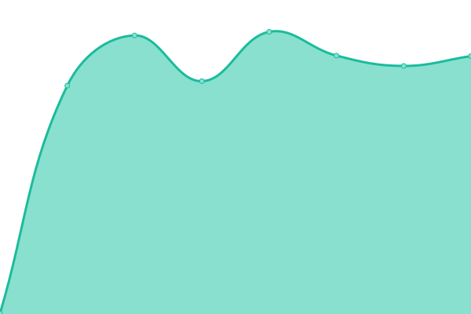

# [📈 Live Status](https://status.ramidregos.com): <!--live status--> **🟩 All systems operational**

This repository contains the open-source uptime monitor and status page for [Upptime](https://upptime.js.org), powered by [Upptime](https://github.com/upptime/upptime).

With [Upptime](https://upptime.js.org), you can get your own unlimited and free uptime monitor and status page, powered entirely by a GitHub repository. We use [Issues](https://github.com/upptime/upptime/issues) as incident reports, [Actions](https://github.com/dregos13/status_client/actions) as uptime monitors, and [Pages](https://status.ramidregos.com) for the status page.

<!--start: status pages-->
<!-- This summary is generated by Upptime (https://github.com/upptime/upptime) -->
<!-- Do not edit this manually, your changes will be overwritten -->
<!-- prettier-ignore -->
| URL | Status | History | Response Time | Uptime |
| --- | ------ | ------- | ------------- | ------ |
|  FTG | 🟩 Up | [ftg.yml](https://github.com/Dregos13/client_status/commits/HEAD/history/ftg.yml) | 

 222ms
     
 | 

<a href="https://status.ramidregos.com/history/ftg">100.00%</a>
    

|  Wang | 🟩 Up | [wang.yml](https://github.com/Dregos13/client_status/commits/HEAD/history/wang.yml) | 

 222ms
     
 | 

<a href="https://status.ramidregos.com/history/wang">100.00%</a>
    

|  Sensonet | 🟩 Up | [sensonet.yml](https://github.com/Dregos13/client_status/commits/HEAD/history/sensonet.yml) | 

 221ms
     
 | 

<a href="https://status.ramidregos.com/history/sensonet">100.00%</a>
    

|  Transalta | 🟩 Up | [transalta.yml](https://github.com/Dregos13/client_status/commits/HEAD/history/transalta.yml) | 

 213ms
     
 | 

<a href="https://status.ramidregos.com/history/transalta">100.00%</a>
    

|  RGSUSA | 🟩 Up | [rgsusa.yml](https://github.com/Dregos13/client_status/commits/HEAD/history/rgsusa.yml) | 

 233ms
     
 | 

<a href="https://status.ramidregos.com/history/rgsusa">100.00%</a>
    

|  America | 🟩 Up | [america.yml](https://github.com/Dregos13/client_status/commits/HEAD/history/america.yml) | 

 204ms
     
 | 

<a href="https://status.ramidregos.com/history/america">100.00%</a>
    

|  MetroSantiago | 🟩 Up | [metro-santiago.yml](https://github.com/Dregos13/client_status/commits/HEAD/history/metro-santiago.yml) | 

 193ms
     
 | 

<a href="https://status.ramidregos.com/history/metro-santiago">100.00%</a>
    

|  Erindia | 🟩 Up | [erindia.yml](https://github.com/Dregos13/client_status/commits/HEAD/history/erindia.yml) | 

 962ms
     
 | 

<a href="https://status.ramidregos.com/history/erindia">98.02%</a>
    

|  Europe | 🟩 Up | [europe.yml](https://github.com/Dregos13/client_status/commits/HEAD/history/europe.yml) | 

 939ms
     
 | 

<a href="https://status.ramidregos.com/history/europe">100.00%</a>
    

|  AlUla | 🟩 Up | [al-ula.yml](https://github.com/Dregos13/client_status/commits/HEAD/history/al-ula.yml) | 

 955ms
     
 | 

<a href="https://status.ramidregos.com/history/al-ula">100.00%</a>
    

|  Neom | 🟩 Up | [neom.yml](https://github.com/Dregos13/client_status/commits/HEAD/history/neom.yml) | 

 954ms
     
 | 

<a href="https://status.ramidregos.com/history/neom">98.02%</a>
    

|  ACES | 🟩 Up | [aces.yml](https://github.com/Dregos13/client_status/commits/HEAD/history/aces.yml) | 

 969ms
     
 | 

<a href="https://status.ramidregos.com/history/aces">100.00%</a>
    

|  Hattadam | 🟩 Up | [hattadam.yml](https://github.com/Dregos13/client_status/commits/HEAD/history/hattadam.yml) | 

 954ms
     
 | 

<a href="https://status.ramidregos.com/history/hattadam">100.00%</a>
    

|  RTA | 🟩 Up | [rta.yml](https://github.com/Dregos13/client_status/commits/HEAD/history/rta.yml) | 

 947ms
     
 | 

<a href="https://status.ramidregos.com/history/rta">100.00%</a>
    

|  WapCos | 🟩 Up | [wap-cos.yml](https://github.com/Dregos13/client_status/commits/HEAD/history/wap-cos.yml) | 

 935ms
     
 | 

<a href="https://status.ramidregos.com/history/wap-cos">100.00%</a>
    

|  Demo | 🟩 Up | [demo.yml](https://github.com/Dregos13/client_status/commits/HEAD/history/demo.yml) | 

 932ms
     
 | 

<a href="https://status.ramidregos.com/history/demo">100.00%</a>
    

|  DigitalDemo | 🟩 Up | [digital-demo.yml](https://github.com/Dregos13/client_status/commits/HEAD/history/digital-demo.yml) | 

 215ms
     
 | 

<a href="https://status.ramidregos.com/history/digital-demo">99.84%</a>
    

<!--end: status pages-->

[**Visit our status website →**](https://status.ramidregos.com)

## 📄 License

- Powered by: [Upptime](https://github.com/upptime/upptime)
- Code: [MIT](./LICENSE) © [Anand Chowdhary](https://anandchowdhary.com), supported by [Pabio](https://pabio.com)
- Data in the `./history` directory: [Open Database License](https://opendatacommons.org/licenses/odbl/1-0/)
