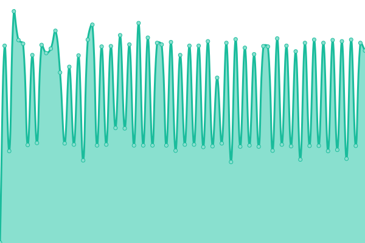
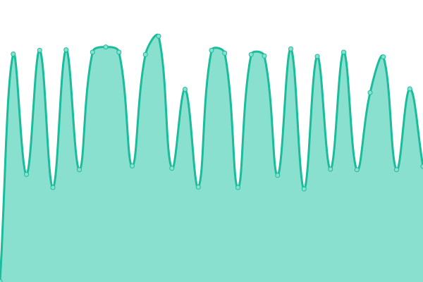
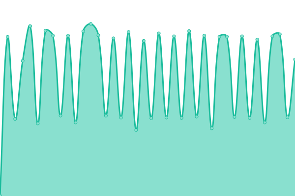

# [📈 Live Status](https://status.ramidregos.com): <!--live status--> **🟧 Partial outage**

This repository contains the open-source uptime monitor and status page for [Upptime](https://upptime.js.org), powered by [Upptime](https://github.com/upptime/upptime).

With [Upptime](https://upptime.js.org), you can get your own unlimited and free uptime monitor and status page, powered entirely by a GitHub repository. We use [Issues](https://github.com/upptime/upptime/issues) as incident reports, [Actions](https://github.com/dregos13/status_client/actions) as uptime monitors, and [Pages](https://status.ramidregos.com) for the status page.

<!--start: status pages-->
<!-- This summary is generated by Upptime (https://github.com/upptime/upptime) -->
<!-- Do not edit this manually, your changes will be overwritten -->
<!-- prettier-ignore -->
| URL | Status | History | Response Time | Uptime |
| --- | ------ | ------- | ------------- | ------ |
|  Demo | 🟩 Up | [demo.yml](https://github.com/Dregos13/ClientStatus/commits/HEAD/history/demo.yml) | 

 1095ms
     
 | 

<a href="https://status.ramidregos.com/history/demo">100.00%</a>
    

|  Demo - Comments | 🟩 Up | [demo-comments.yml](https://github.com/Dregos13/ClientStatus/commits/HEAD/history/demo-comments.yml) | 

 1461ms
     
 | 

<a href="https://status.ramidregos.com/history/demo-comments">99.32%</a>
    

|  Demo - Dashboards | 🟥 Down | [demo-dashboards.yml](https://github.com/Dregos13/ClientStatus/commits/HEAD/history/demo-dashboards.yml) | 

 384ms
     
 | 

<a href="https://status.ramidregos.com/history/demo-dashboards">98.29%</a>
    

|  Demo - Data-Logger | 🟩 Up | [demo-data-logger.yml](https://github.com/Dregos13/ClientStatus/commits/HEAD/history/demo-data-logger.yml) | 

 388ms
     
 | 

<a href="https://status.ramidregos.com/history/demo-data-logger">97.96%</a>
    

|  Demo - Data-Processing | 🟥 Down | [demo-data-processing.yml](https://github.com/Dregos13/ClientStatus/commits/HEAD/history/demo-data-processing.yml) | 

 384ms
     
 | 

<a href="https://status.ramidregos.com/history/demo-data-processing">93.14%</a>
    

|  Demo - Hierarchy | 🟩 Up | [demo-hierarchy.yml](https://github.com/Dregos13/ClientStatus/commits/HEAD/history/demo-hierarchy.yml) | 

 397ms
     
 | 

<a href="https://status.ramidregos.com/history/demo-hierarchy">99.26%</a>
    

|  Demo - Instruments | 🟩 Up | [demo-instruments.yml](https://github.com/Dregos13/ClientStatus/commits/HEAD/history/demo-instruments.yml) | 

 405ms
     
 | 

<a href="https://status.ramidregos.com/history/demo-instruments">99.46%</a>
    

|  Demo - Layers | 🟥 Down | [demo-layers.yml](https://github.com/Dregos13/ClientStatus/commits/HEAD/history/demo-layers.yml) | 

 395ms
     
 | 

<a href="https://status.ramidregos.com/history/demo-layers">99.31%</a>
    

|  Demo - Notifications | 🟥 Down | [demo-notifications.yml](https://github.com/Dregos13/ClientStatus/commits/HEAD/history/demo-notifications.yml) | 

 380ms
     
 | 

<a href="https://status.ramidregos.com/history/demo-notifications">92.54%</a>
    

|  DigitalDemo | 🟩 Up | [digital-demo.yml](https://github.com/Dregos13/ClientStatus/commits/HEAD/history/digital-demo.yml) | 

 539ms
     
 | 

<a href="https://status.ramidregos.com/history/digital-demo">100.00%</a>
    

|  DigitalDemo - Comments | 🟥 Down | [digital-demo-comments.yml](https://github.com/Dregos13/ClientStatus/commits/HEAD/history/digital-demo-comments.yml) | 

 305ms
     
 | 

<a href="https://status.ramidregos.com/history/digital-demo-comments">0.00%</a>
    

|  DigitalDemo - Dashboards | 🟥 Down | [digital-demo-dashboards.yml](https://github.com/Dregos13/ClientStatus/commits/HEAD/history/digital-demo-dashboards.yml) | 

 37ms
     
 | 

<a href="https://status.ramidregos.com/history/digital-demo-dashboards">0.00%</a>
    

|  DigitalDemo - Data-Logger | 🟥 Down | [digital-demo-data-logger.yml](https://github.com/Dregos13/ClientStatus/commits/HEAD/history/digital-demo-data-logger.yml) | 

 10038ms
     
 | 

<a href="https://status.ramidregos.com/history/digital-demo-data-logger">0.00%</a>
    

|  DigitalDemo - Data-Processing | 🟥 Down | [digital-demo-data-processing.yml](https://github.com/Dregos13/ClientStatus/commits/HEAD/history/digital-demo-data-processing.yml) | 

 37ms
     
 | 

<a href="https://status.ramidregos.com/history/digital-demo-data-processing">0.00%</a>
    

|  DigitalDemo - Hierarchy | 🟥 Down | [digital-demo-hierarchy.yml](https://github.com/Dregos13/ClientStatus/commits/HEAD/history/digital-demo-hierarchy.yml) | 

 37ms
     
 | 

<a href="https://status.ramidregos.com/history/digital-demo-hierarchy">0.00%</a>
    

|  DigitalDemo - Instruments | 🟥 Down | [digital-demo-instruments.yml](https://github.com/Dregos13/ClientStatus/commits/HEAD/history/digital-demo-instruments.yml) | 

 10039ms
     
 | 

<a href="https://status.ramidregos.com/history/digital-demo-instruments">0.00%</a>
    

|  DigitalDemo - Layers | 🟥 Down | [digital-demo-layers.yml](https://github.com/Dregos13/ClientStatus/commits/HEAD/history/digital-demo-layers.yml) | 

 10040ms
     
 | 

<a href="https://status.ramidregos.com/history/digital-demo-layers">0.00%</a>
    

|  DigitalDemo - Notifications | 🟥 Down | [digital-demo-notifications.yml](https://github.com/Dregos13/ClientStatus/commits/HEAD/history/digital-demo-notifications.yml) | 

 10041ms
     
 | 

<a href="https://status.ramidregos.com/history/digital-demo-notifications">0.00%</a>
    

<!--end: status pages-->

[**Visit our status website →**](https://status.ramidregos.com)

## 📄 License

- Powered by: [Upptime](https://github.com/upptime/upptime)
- Code: [MIT](./LICENSE) © [Anand Chowdhary](https://anandchowdhary.com), supported by [Pabio](https://pabio.com)
- Data in the `./history` directory: [Open Database License](https://opendatacommons.org/licenses/odbl/1-0/)
